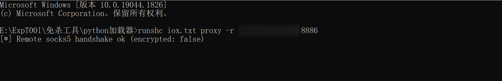
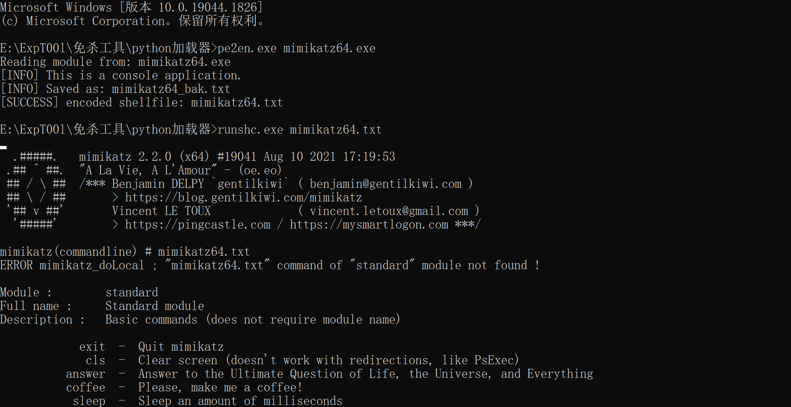
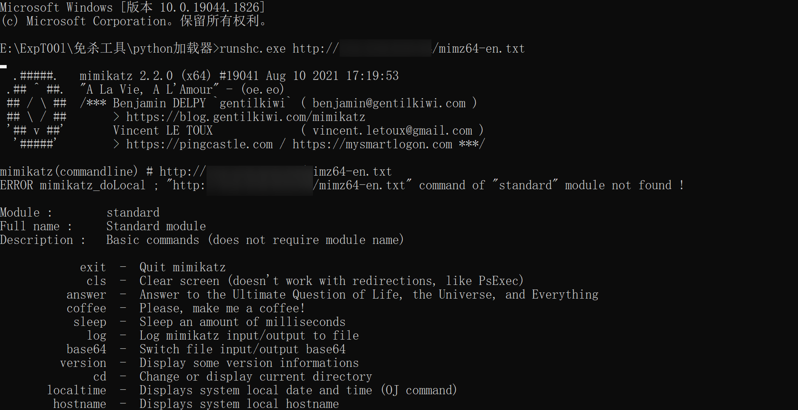
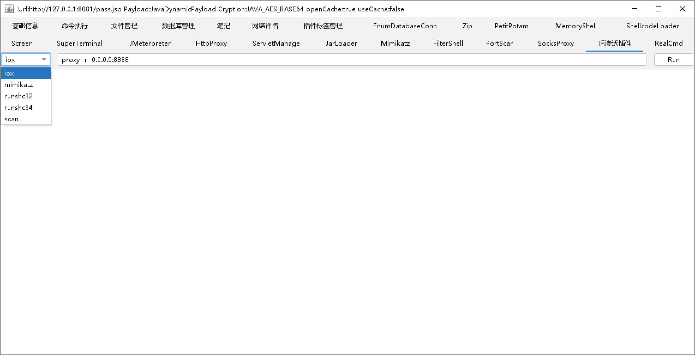
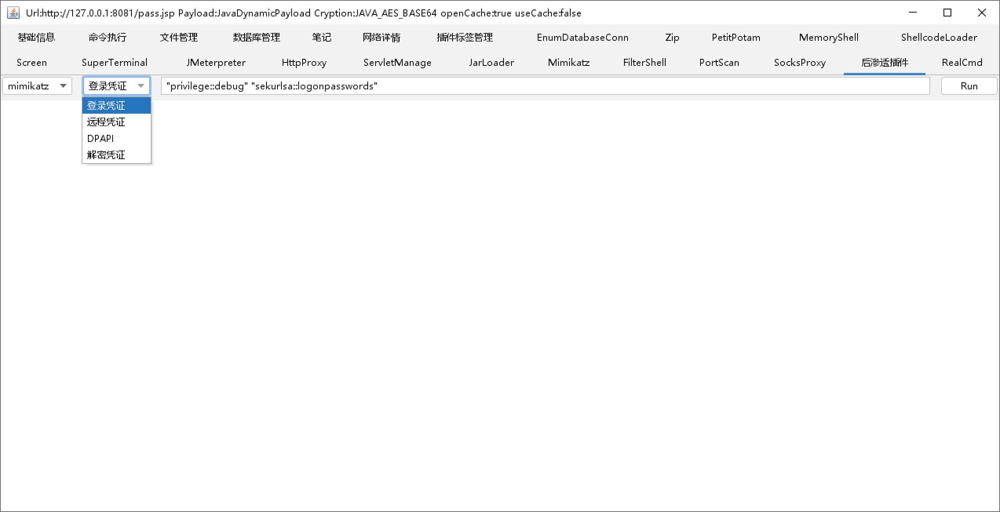

## Sch_Bypass

#### IOX_NEW

略微修改iox，使其在以shellcode形式加载时能正确接收参数：

#### Python_Schloader

python加载器，采用多重异或加密，支持远程加载shellcode：

#### Godzilla_Plugins

哥斯拉插件，基于4.0版本内置shellcode内存加载功能，一键加载pe文件至JVM内存中，目前支持iox、mimikatz、runshc：

> javashellcoder加载iox会报错，可使用runshc间接加载
>
> scan -> 扫描程序，体积过大暂时无法加载

